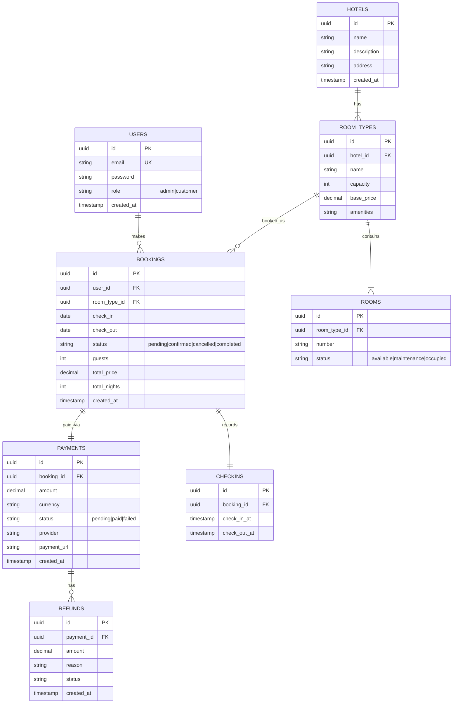

# Entity Relationship Diagram (ERD)
## Hotel Booking Microservices

```mermaid
erDiagram
    %% User Management
    USERS ||--o{ BOOKINGS : "makes"
    USERS {
        uuid id PK
        string email UK
        string password
        string role "admin|customer"
        timestamp created_at
    }

    %% Hotel Inventory
    HOTELS ||--|{ ROOM_TYPES : "has"
    HOTELS {
        uuid id PK
        string name
        string description
        string address
        timestamp created_at
    }

    ROOM_TYPES ||--|{ ROOMS : "contains"
    ROOM_TYPES ||--o{ BOOKINGS : "booked_as"
    ROOM_TYPES {
        uuid id PK
        uuid hotel_id FK
        string name
        int capacity
        decimal base_price
        string amenities
    }

    ROOMS {
        uuid id PK
        uuid room_type_id FK
        string number
        string status "available|maintenance|occupied"
    }

    %% Booking Lifecycle
    BOOKINGS ||--|| PAYMENTS : "paid_via"
    BOOKINGS ||--|| CHECKINS : "records"
    BOOKINGS {
        uuid id PK
        uuid user_id FK
        uuid room_type_id FK
        date check_in
        date check_out
        string status "pending|confirmed|cancelled|completed"
        int guests
        decimal total_price
        int total_nights
        timestamp created_at
    }

    %% Payment & Refunds
    PAYMENTS ||--o{ REFUNDS : "has"
    PAYMENTS {
        uuid id PK
        uuid booking_id FK
        decimal amount
        string currency
        string status "pending|paid|failed"
        string provider
        string payment_url
        timestamp created_at
    }

    REFUNDS {
        uuid id PK
        uuid payment_id FK
        decimal amount
        string reason
        string status
        timestamp created_at
    }

    CHECKINS {
        uuid id PK
        uuid booking_id FK
        timestamp check_in_at
        timestamp check_out_at
    }
```

### Legend
- **PK**: Primary Key
- **FK**: Foreign Key
- **UK**: Unique Key
- **||--o{**: One-to-Many
- **||--||**: One-to-One
