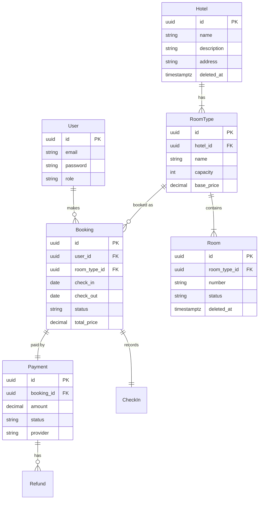

# Entity & Requirement Analysis
## Hotel Booking Microservices

This document analyzes data requirements and entities based on the database schema (`migrations/001_init.sql`) and current domain implementation.

---

## 🗺️ Entity Relationship Diagram (ERD)

---

## 📋 Entity Details & Requirements

### 1. User
**Table**: `users`
**Domain**: `auth.User`

| Attribute | Type | Constraint | Requirement / Business Rule |
|-----------|------|------------|--------------------------------|
| `id` | UUID | PK | Unique user identifier. |
| `email` | TEXT | UNIQUE | Email must be unique, used for login. |
| `password` | TEXT | NOT NULL | Stored as hash (bcrypt). |
| `role` | TEXT | NOT NULL | `admin` (can manage hotels) or `customer` (booking only). |

### 2. Hotel 
**Table**: `hotels`
**Domain**: `hotel.Hotel`

| Attribute | Type | Constraint | Requirement / Business Rule |
|-----------|------|------------|--------------------------------|
| `id` | UUID | PK | Unique hotel identifier. |
| `name` | TEXT | NOT NULL | Hotel name is mandatory. |
| `description` | TEXT | - | Hotel description (optional). |
| `address` | TEXT | - | Physical address of the hotel. |
| `created_at` | TIMESTAMPTZ | NOT NULL | Audit trail for creation. |
| `deleted_at` | TIMESTAMPTZ | - | Soft delete timestamp (NULL if active). |

**CRUD Operations**:
- ✅ Create (POST /hotels) - Admin only
- ✅ Read (GET /hotels, GET /hotels/{id}) - Public
- ✅ Update (PUT /hotels/{id}) - Admin only 
- ✅ Delete (DELETE /hotels/{id}) - Admin only, soft delete 

### 3. Room Type
**Table**: `room_types`
**Domain**: `hotel.RoomType`

| Attribute | Type | Constraint | Requirement / Business Rule |
|-----------|------|------------|--------------------------------|
| `id` | UUID | PK | Unique room type identifier. |
| `hotel_id` | UUID | FK | Room type must belong to a specific hotel. |
| `capacity` | INT | NOT NULL | Maximum guest capacity (for booking validation). |
| `base_price`| NUMERIC| NOT NULL | Price per night (basis for total calculation). |

### 4. Room (Physical Unit) 
**Table**: `rooms`
**Domain**: `hotel.Room`

| Attribute | Type | Constraint | Requirement / Business Rule |
|-----------|------|------------|--------------------------------|
| `id` | UUID | PK | Unique physical room unit identifier. |
| `room_type_id`| UUID | FK | Which type this room belongs to (e.g., 101 is Deluxe). |
| `number` | TEXT | NOT NULL | Room number (e.g., "101", "202A"). |
| `status` | TEXT | DEFAULT 'available' | Physical status: `available`, `maintenance`, `occupied`. |
| `deleted_at` | TIMESTAMPTZ | - | Soft delete timestamp (NULL if active). |

**CRUD Operations**:
- ✅ Create (POST /rooms) - Admin only
- ✅ Read (GET /rooms, GET /rooms/{id}) - Public 
- ✅ Update (PUT /rooms/{id}) - Admin only 
- ✅ Delete (DELETE /rooms/{id}) - Admin only, soft delete 

### 5. Booking 
**Table**: `bookings`
**Domain**: `booking.Booking`

| Attribute | Type | Constraint | Requirement / Business Rule |
|-----------|------|------------|--------------------------------|
| `id` | UUID | PK | Unique booking identifier. |
| `user_id` | UUID | FK | Who made the booking. |
| `room_type_id`| UUID | FK | Type of room booked (not specific room number at booking time). |
| `check_in` | DATE | NOT NULL | Check-in date. |
| `check_out` | DATE | NOT NULL | Check-out date (must be > check_in). |
| `status` | TEXT | NOT NULL | Lifecycle: `pending_payment` → `confirmed` → `checked_in` → `completed` (or `cancelled`). |
| `total_price`| NUMERIC| NOT NULL | Final price after discount/calculation. |

**Auto-Checkout Feature** :
- CronJob runs daily at 10:00 AM
- Automatically transitions bookings from `checked_in` to `completed` when `check_out` date = today
- Implemented using `robfig/cron/v3` in booking-service
- Publishes domain events for notification

### 6. Payment
**Table**: `payments`
**Domain**: `payment.Payment`

| Attribute | Type | Constraint | Requirement / Business Rule |
|-----------|------|------------|--------------------------------|
| `id` | UUID | PK | Unique payment transaction identifier. |
| `booking_id`| UUID | UNIQUE FK | One booking has only one active payment. |
| `amount` | NUMERIC| NOT NULL | Amount to be paid (must match `booking.total_price`). |
| `status` | TEXT | NOT NULL | `pending`, `paid`, `failed`, `refunded`. |
| `provider` | TEXT | NOT NULL | Gateway used (e.g., `xendit`, `midtrans`). |

---

## 🔗 Key Relationships & Rules

1.  **Hotel Inventory Hierarchy**:
    - Hotel has many Room Types.
    - Room Type has many physical Rooms.
    - *Rule*: When users book, they choose a **Room Type**, not a specific Room. Specific Room is assigned at Check-in (or automatically by inventory system).

2.  **Booking Flow**:
    - User creates Booking -> Status `pending_payment`.
    - System creates related Payment record.
    - User pays -> Payment status `paid` -> Booking status `confirmed`.
    - **Auto-Checkout** : CronJob automatically completes bookings at checkout date.

3.  **Data Integrity**:
    - All IDs use **UUID** (v4) to avoid collision and enumeration.
    - Foreign Keys (`REFERENCES`) ensure referential integrity (cannot book non-existent hotel).
    - `TIMESTAMPTZ` used to record time with clear time zone.
    - **Soft Delete** : Hotels and Rooms use soft delete (`deleted_at` timestamp) to preserve data integrity.

---

## 💡 Analysis Conclusion

This database structure supports the core needs of the hotel booking application:
- ✅ **Multi-tenancy**: Can handle multiple hotels.
- ✅ **Inventory Management**: Separation of Room Type (Logical) and Room Unit (Physical).
- ✅ **Transactional Integrity**: Booking and Payment separated but linked 1-to-1.
- ✅ **Audit Trail**: `created_at` in every table.
- ✅ **Full CRUD Operations** : Complete management capabilities for Hotel and Room entities.
- ✅ **Automated Processes** : CronJob-based auto-checkout for operational efficiency.
