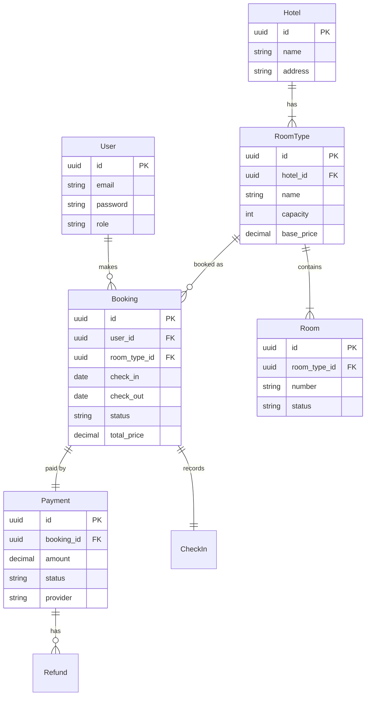

# Entity & Requirement Analysis
## Hotel Booking Microservices

Dokumen ini menganalisis kebutuhan data dan entitas berdasarkan skema database (`migrations/001_init.sql`) dan implementasi domain saat ini.

---

## 🗺️ Entity Relationship Diagram (ERD)

---

## 📋 Entity Details & Requirements

### 1. User (Pengguna)
**Table**: `users`
**Domain**: `auth.User`

| Attribute | Type | Constraint | Requirement / Business Rule |
|-----------|------|------------|-----------------------------|
| `id` | UUID | PK | Unique identifier pengguna. |
| `email` | TEXT | UNIQUE | Email harus unik, digunakan untuk login. |
| `password` | TEXT | NOT NULL | Disimpan dalam bentuk hash (bcrypt). |
| `role` | TEXT | NOT NULL | `admin` (bisa kelola hotel) atau `customer` (hanya booking). |

### 2. Hotel
**Table**: `hotels`
**Domain**: `hotel.Hotel`

| Attribute | Type | Constraint | Requirement / Business Rule |
|-----------|------|------------|-----------------------------|
| `id` | UUID | PK | Unique identifier hotel. |
| `name` | TEXT | NOT NULL | Nama hotel wajib ada. |
| `address` | TEXT | - | Alamat fisik hotel. |

### 3. Room Type (Tipe Kamar)
**Table**: `room_types`
**Domain**: `hotel.RoomType`

| Attribute | Type | Constraint | Requirement / Business Rule |
|-----------|------|------------|-----------------------------|
| `id` | UUID | PK | Unique identifier tipe kamar. |
| `hotel_id` | UUID | FK | Tipe kamar harus milik satu hotel spesifik. |
| `capacity` | INT | NOT NULL | Jumlah tamu maksimal (untuk validasi booking). |
| `base_price`| NUMERIC| NOT NULL | Harga per malam (basis kalkulasi total). |

### 4. Room (Unit Kamar)
**Table**: `rooms`
**Domain**: `hotel.Room`

| Attribute | Type | Constraint | Requirement / Business Rule |
|-----------|------|------------|-----------------------------|
| `id` | UUID | PK | Unique identifier unit kamar fisik. |
| `room_type_id`| UUID | FK | Kamar ini termasuk tipe apa (misal: 101 adalah Deluxe). |
| `number` | TEXT | NOT NULL | Nomor kamar (misal: "101", "202A"). |
| `status` | TEXT | DEFAULT 'available' | Status fisik: `available`, `maintenance`, `occupied`. |

### 5. Booking (Pemesanan)
**Table**: `bookings`
**Domain**: `booking.Booking`

| Attribute | Type | Constraint | Requirement / Business Rule |
|-----------|------|------------|-----------------------------|
| `id` | UUID | PK | Unique identifier booking. |
| `user_id` | UUID | FK | Siapa yang memesan. |
| `room_type_id`| UUID | FK | Tipe kamar yang dipesan (bukan nomor kamar spesifik saat booking). |
| `check_in` | DATE | NOT NULL | Tanggal masuk. |
| `check_out` | DATE | NOT NULL | Tanggal keluar (harus > check_in). |
| `status` | TEXT | NOT NULL | Lifecycle: `pending_payment` → `confirmed` → `checked_in` → `completed` (atau `cancelled`). |
| `total_price`| NUMERIC| NOT NULL | Harga final setelah diskon/kalkulasi. |

### 6. Payment (Pembayaran)
**Table**: `payments`
**Domain**: `payment.Payment`

| Attribute | Type | Constraint | Requirement / Business Rule |
|-----------|------|------------|-----------------------------|
| `id` | UUID | PK | Unique identifier transaksi pembayaran. |
| `booking_id`| UUID | UNIQUE FK | Satu booking hanya punya satu pembayaran aktif. |
| `amount` | NUMERIC| NOT NULL | Jumlah yang harus dibayar (harus match `booking.total_price`). |
| `status` | TEXT | NOT NULL | `pending`, `paid`, `failed`, `refunded`. |
| `provider` | TEXT | NOT NULL | Gateway yang dipakai (misal: `xendit`, `midtrans`). |

---

## 🔗 Key Relationships & Rules

1.  **Hotel Inventory Hierarchy**:
    - Hotel punya banyak Room Types.
    - Room Type punya banyak physical Rooms.
    - *Rule*: Saat user booking, mereka memilih **Room Type**, bukan Room spesifik. Room spesifik baru di-assign saat Check-in (atau otomatis oleh sistem inventory).

2.  **Booking Flow**:
    - User membuat Booking -> Status `pending_payment`.
    - System membuat record Payment terkait.
    - User membayar -> Payment status `paid` -> Booking status `confirmed`.

3.  **Data Integrity**:
    - Semua ID menggunakan **UUID** (v4) untuk menghindari collision dan enumerasi.
    - Foreign Keys (`REFERENCES`) menjamin referential integrity (tidak bisa booking hotel yang tidak ada).
    - `TIMESTAMPTZ` digunakan untuk mencatat waktu dengan zona waktu yang jelas.

---

## 💡 Analysis Conclusion

Struktur database ini sudah mendukung kebutuhan inti aplikasi hotel booking:
- ✅ **Multi-tenancy**: Bisa banyak hotel.
- ✅ **Inventory Management**: Pemisahan Tipe Kamar (Logical) dan Unit Kamar (Physical).
- ✅ **Transactional Integrity**: Booking dan Payment terpisah tapi terhubung 1-to-1.
- ✅ **Audit Trail**: `created_at` di setiap tabel.
